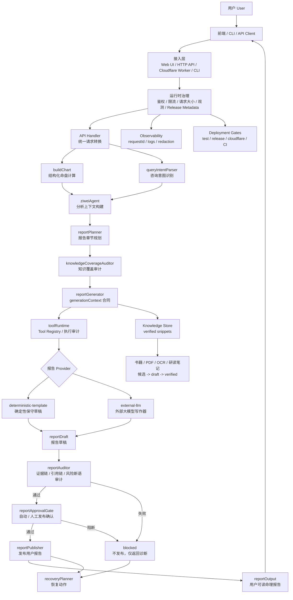
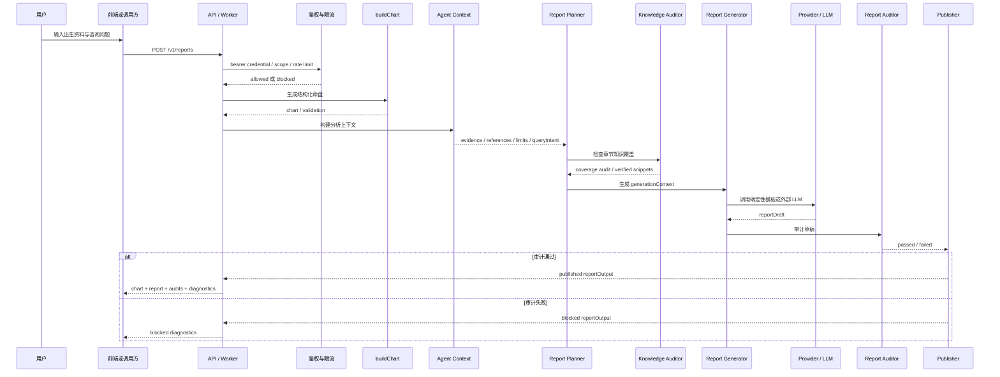
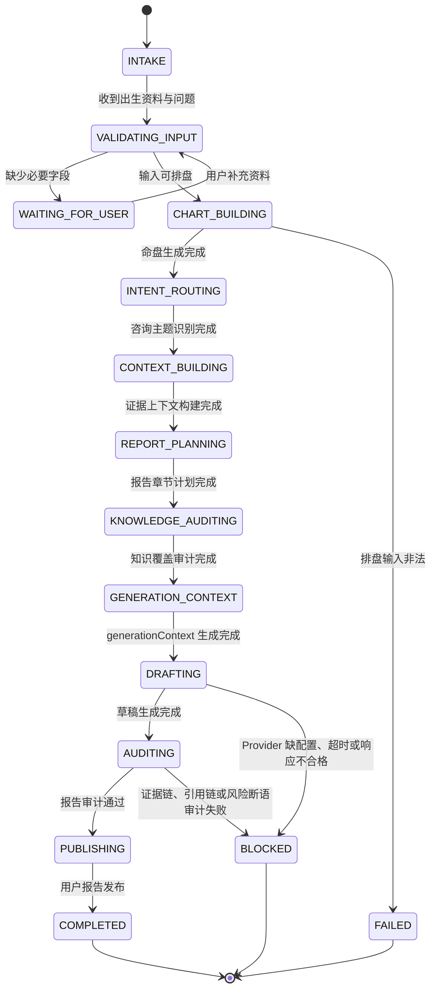
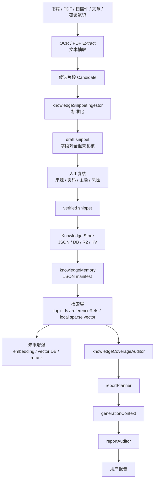
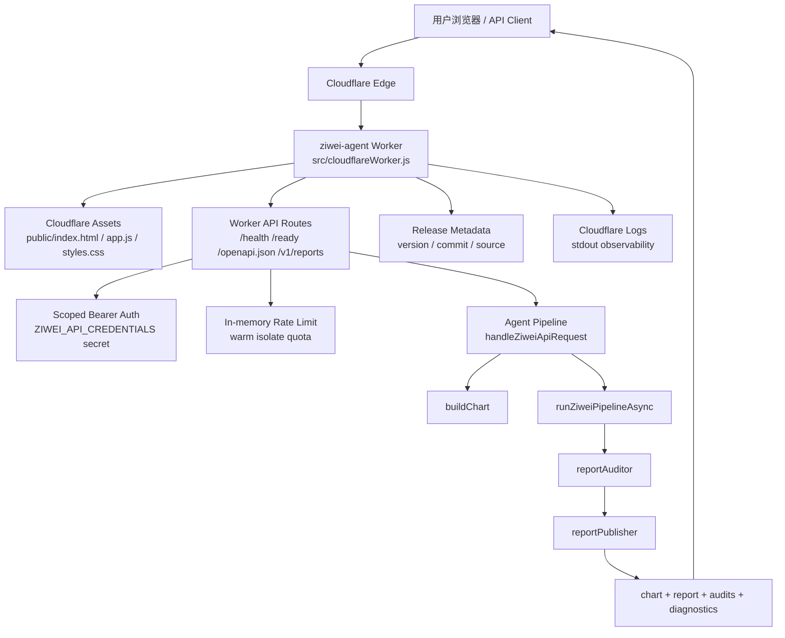
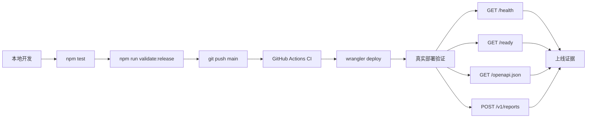

# 紫微斗数命理师 Agent 系统架构

本文档把通用复杂 Agent 架构落到当前紫微斗数项目上，用于说明系统为什么不是“LLM + tools 循环”，而是一个可控、可审计、可部署的命理报告执行系统。

## 架构文本

复杂 Agent 的关键不是让大模型自由发挥，而是把大模型放进受控任务系统里。对当前项目来说：

```text
紫微斗数命理师 Agent
  = 出生资料采集与校验
  + 命盘计算
  + 用户咨询意图识别
  + 命盘证据组织
  + 知识库检索与审计
  + 报告规划
  + 报告生成器合同
  + Tool Runtime
  + 确定性或外部大模型写作 provider
  + 报告审计
  + 产品侧发布确认
  + 发布门禁
  + 恢复计划
  + API 鉴权、限流、观测、部署验证
```

当前系统的核心原则是：

- 排盘计算层只负责结构化命盘，不写报告。
- 报告层只使用 pipeline 提供的证据、引用和知识片段，不重新排盘。
- 外部大模型只能作为报告写作 provider，不能绕过证据链、知识审计和发布门禁。
- 报告 provider 必须通过 `toolRuntime` 登记和执行，不能在 pipeline 中裸调用不可审计函数。
- 用户最终拿到的是 `reportOutput` 用户报告，而不是模型自由聊天文本。
- 未通过 `reportAuditor` 的草稿不能发布。
- 在 `require-review` 策略下，未通过人工发布确认的草稿不能发布。
- 阻断、审计失败和能力缺口必须进入 `recoveryPlan`，不能只停留在散落的错误文案。
- 生产环境缺少 `reports:write` credential 时必须 fail-closed。

## 当前生产链路

当前主链路是：

```text
用户输入 profile/query
  -> API/Web/CLI 接入
  -> 运行时治理：鉴权、限流、请求大小、观测、release metadata
  -> buildChart 生成结构化命盘
  -> queryIntentParser 识别咨询主题
  -> ziweiAgent 构建分析上下文
  -> reportPlanner 规划报告章节
  -> knowledgeCoverageAuditor 审计知识覆盖
  -> reportGenerator 构建 generationContext
  -> toolRuntime 登记并执行报告 provider
  -> deterministic-template 或 external-llm provider 生成草稿
  -> reportAuditor 审计断语、证据链和引用链
  -> reportApprovalGate 执行自动或人工发布确认
  -> reportPublisher 发布用户报告
  -> recoveryPlanner 生成恢复动作或非阻断补强建议
```

这条链路必须保持单向约束：

```text
输入资料 -> 命盘结构 -> 证据上下文 -> 报告计划 -> 草稿 -> 审计 -> 发布
```

不允许：

- UI 直接生成解释。
- API handler 跳过 pipeline 直接调用 composer。
- 外部 LLM 直接读取整份命盘并自由断语。
- 没有 verified 知识片段却伪装成文献支撑。
- 把因果、前世今生等象征性主题写成事实判断。

## 模块职责

| 层级 | 当前模块 | 职责 |
|---|---|---|
| 接入层 | `public/`, `src/server.js`, `src/cloudflareWorker.js`, `src/cli.js` | 接收用户输入，调用同一条 agent pipeline |
| API 治理 | `apiCredentials`, `apiRateLimiter`, `apiObservability`, `serverRuntimeConfig`, `runtimeEnv` | 鉴权、限流、脱敏日志、配置校验、secret 汇合、运行时门禁 |
| 排盘层 | `chartBuilder`, 各类 calculator | 生成结构化命盘和运限骨架 |
| 意图层 | `queryIntentParser` | 把用户咨询转换为可审计专题 |
| Agent 上下文层 | `ziweiAgent` | 把命盘转为证据、重点、限制、追问 |
| 规划层 | `reportPlanner`, `topicRefinementInterpreter` | 生成章节计划和专题任务单 |
| 知识层 | `knowledgeSnippetCatalog`, `knowledgeSnippetStore`, `knowledgeCoverageAuditor` | 管理 verified 知识片段，审计章节知识覆盖 |
| 工具执行层 | `toolRuntime` | 登记工具、执行工具、记录 toolId/合同/耗时/阻断原因 |
| 生成层 | `reportGenerator`, `reportComposer`, `externalLLMReportProvider` | 用受控 generation context 生成报告草稿 |
| 审计发布层 | `reportAuditor`, `reportApprovalGate`, `reportPublisher` | 阻断越权断语、执行发布确认，发布合格用户报告 |
| 恢复层 | `recoveryPlanner` | 把阻断、审计失败和能力缺口转换为 owner/priority/nextStep 明确的恢复计划 |
| 部署运维层 | `validateRelease`, `validateDeployment`, `validateCloudflare`, `smokeApi`, `docs/OPERATIONS.md` | 本地、CI、Cloudflare、容器和运维验证 |

## 总体架构图



## 执行时序图



## Agent 状态机



## 知识库与 RAG 演进图

当前已经有 JSON store、verified snippet 审计、knowledge memory manifest 和本地稀疏向量检索索引；后续可以接入 OCR、PDF 解析、外部 embedding、向量数据库、重排和权限过滤，但所有材料仍必须先进入可追溯 snippet 合同。



## Cloudflare 部署架构图



## 部署与验证闭环



## 当前完成度判断

底层工程已经具备完整可部署基线：

- 本地 release gate 已包含测试、知识库、运行时、部署、Cloudflare dry-run 和 diff-check。
- GitHub Actions CI 已能在远端干净环境验证。
- Cloudflare Worker 已真实部署并验证 `/health`、`/ready`、`/openapi.json`、`POST /v1/reports`。
- Agent 主链路没有被 UI、API、Worker 或外部 provider 绕过。

后续重点不再是“能否作为服务跑起来”，而是继续增强：

1. 书籍、PDF、OCR、研读笔记的 verified 知识片段规模。
2. RAG 检索、重排、来源过滤和引用定位。
3. 更细的宫位、星曜、四化、运限组合解释。
4. 用户会话、历史咨询和长期记忆。
5. 更强的大模型 provider 质量审计和报告风格控制。
6. Web UI 的用户登录、会话鉴权和安全调用体验。
